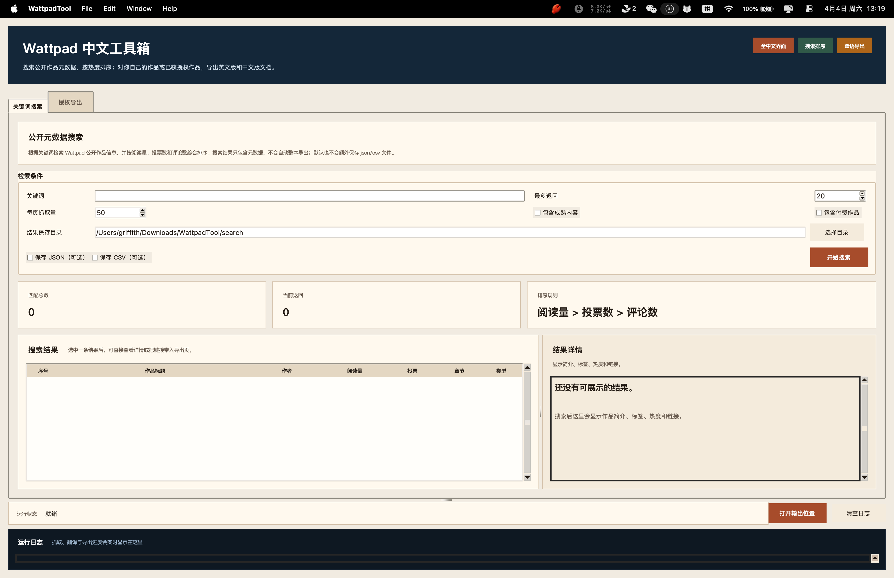
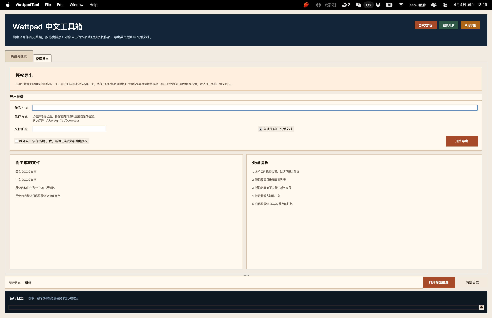

# Wattpad 中文工具箱

[](https://github.com/gleam-studios/wattpad-/actions/workflows/build-release.yml)
[](https://github.com/gleam-studios/wattpad-/releases/latest)
[](https://github.com/gleam-studios/wattpad-)

面向中文用户的 Wattpad 桌面工具，提供两类能力：

- 按关键词搜索 Wattpad 公开作品元数据，并按热度排序
- 对你明确提供且已获授权的免费作品，导出英文版和中文版 Word 文档

项目同时提供：

- 全中文桌面 GUI
- CLI 命令行工具
- macOS / Windows 打包脚本
- GitHub Actions 自动构建流程

## 下载

- 最新版本：<https://github.com/gleam-studios/wattpad-/releases/latest>
- 当前推荐下载：
  - macOS：`WattpadTool-mac.zip`
  - Windows：`WattpadTool-windows.zip`

## 界面预览

### 关键词搜索



### 授权导出



## 功能概览

### 1. 关键词搜索

- 搜索 Wattpad 公开作品元数据
- 按 `阅读量 -> 投票数 -> 评论数 -> 章节数` 排序
- 默认只在界面展示，不会额外生成 `json/csv`
- 如有需要，可手动勾选导出搜索结果

### 2. 授权导出

- 仅接受你主动提供的作品 URL
- 仅允许导出你拥有版权或已获得明确授权的免费作品
- 自动生成英文版 `.docx`
- 可选自动生成中文版 `.docx`
- GUI 导出时会先询问 ZIP 保存位置，默认打开系统下载文件夹
- 最终 ZIP 默认只保留两份 Word 文档，避免输出杂乱

### 3. 跨平台打包

- macOS：生成 `Wattpad 中文工具箱.app`
- Windows：生成 `WattpadTool.exe`
- DOCX 导出已改为纯 Python 实现，不再依赖 macOS `textutil`

## 合规边界

- 搜索只抓取公开元数据
- 不支持从关键词搜索结果中直接整本抓取任意作品
- 导出只适用于你拥有版权或已获得明确授权的免费作品
- 对付费作品会直接拒绝导出

## 运行要求

- Python 3.12 推荐
- macOS 或 Windows
- 可访问 Wattpad 与 Google Translate 接口

安装运行依赖：

```bash
python3 -m pip install -r requirements.txt
```

如果要本地打包桌面应用：

```bash
python3 -m pip install -r requirements-build.txt
```

## 快速开始

### 启动桌面版

源码运行：

```bash
python3 wattpad_app.py
```

mac 本地打包后，直接双击：

- `Wattpad 中文工具箱.app`

### CLI 搜索

```bash
python3 wattpad_tool.py search "hockey" \
  --max-results 20 \
  --json-out ./wattpad_tool_output/hockey.json \
  --csv-out ./wattpad_tool_output/hockey.csv
```

常用参数：

- `--include-mature`
- `--include-paywalled`
- `--page-size 50`

### CLI 导出

```bash
python3 wattpad_tool.py export "https://www.wattpad.com/story/242618522-ice-cold" \
  --authorized \
  --output-dir ./wattpad_tool_output/export_test \
  --basename ice-cold
```

只导出英文版：

```bash
python3 wattpad_tool.py export "https://www.wattpad.com/story/242618522-ice-cold" \
  --authorized \
  --skip-translation
```

CLI 默认会在输出目录生成：

- `*-en.html`
- `*-en.docx`
- `*-zh-cn.html`
- `*-zh-cn.docx`
- `*-metadata.json`

GUI 导出则会自动打包，并默认只保留最终英文/中文 Word 文档。

## 项目结构

```text
.
├── wattpad_app.py              # 全中文桌面 GUI
├── wattpad_tool.py             # 统一 CLI 入口
├── wattpad_export.py           # 英文导出逻辑
├── translate_wattpad_html.py   # 中文翻译逻辑
├── docx_renderer.py            # 跨平台 DOCX 渲染
├── package_app.py              # PyInstaller 打包入口
├── build_macos.sh              # mac 打包脚本
├── build_windows.ps1           # Windows PowerShell 打包脚本
├── build_windows.bat           # Windows 批处理打包脚本
├── release_macos.py            # mac 正式签名 / notarization 辅助脚本
├── requirements.txt            # 运行依赖
├── requirements-build.txt      # 打包依赖
└── .github/workflows/          # GitHub Actions
```

## 本地打包

### macOS

```bash
./build_macos.sh
```

默认产物：

- `dist/Wattpad 中文工具箱.app`
- `dist/WattpadTool-mac.zip`

### Windows

PowerShell：

```powershell
.\build_windows.ps1
```

或批处理：

```bat
build_windows.bat
```

默认产物：

- `dist/WattpadTool.exe`

## GitHub Actions

仓库内置自动构建流程：

- `push` 到 `main` 时自动构建 macOS / Windows 版本
- `pull_request` 时自动验证能否成功打包
- `workflow_dispatch` 可手动触发
- 推送 `v*` 标签时自动构建并发布 Release 资产

说明：

- macOS CI 产物是未 notarize 的构建包，可用于测试与分发前验证
- 如果需要 Apple 正式分发，还需要 `Developer ID Application` 证书和 notarization 凭据

## 当前仓库状态

- 已支持跨平台 Word 导出
- 已支持 mac 本机双击启动包装应用
- 已默认收敛搜索与导出产物，避免目录杂乱

## 许可证与责任

本工具用于处理你拥有版权或已获得明确授权的内容。使用者需自行遵守目标平台条款、版权规则与当地法律。
